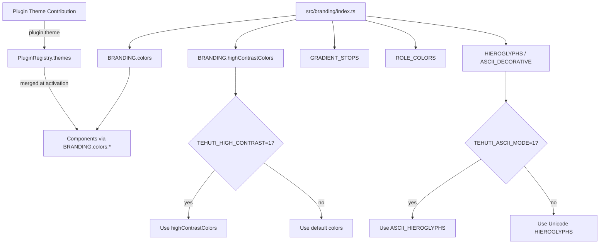
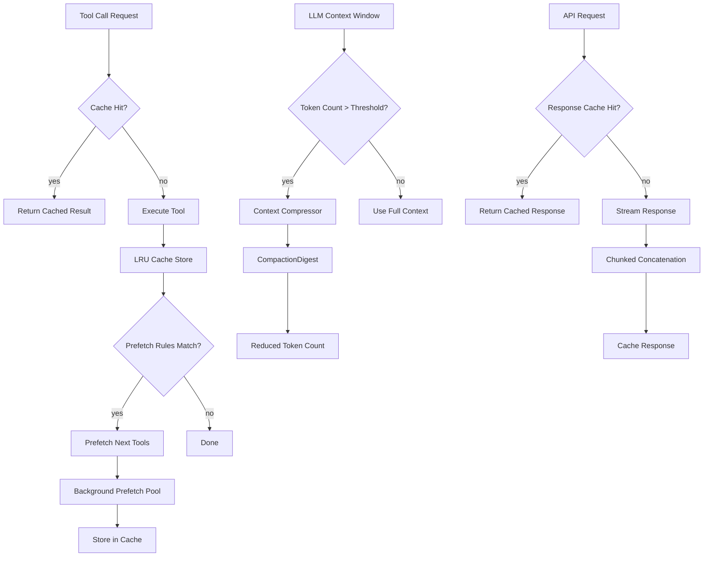
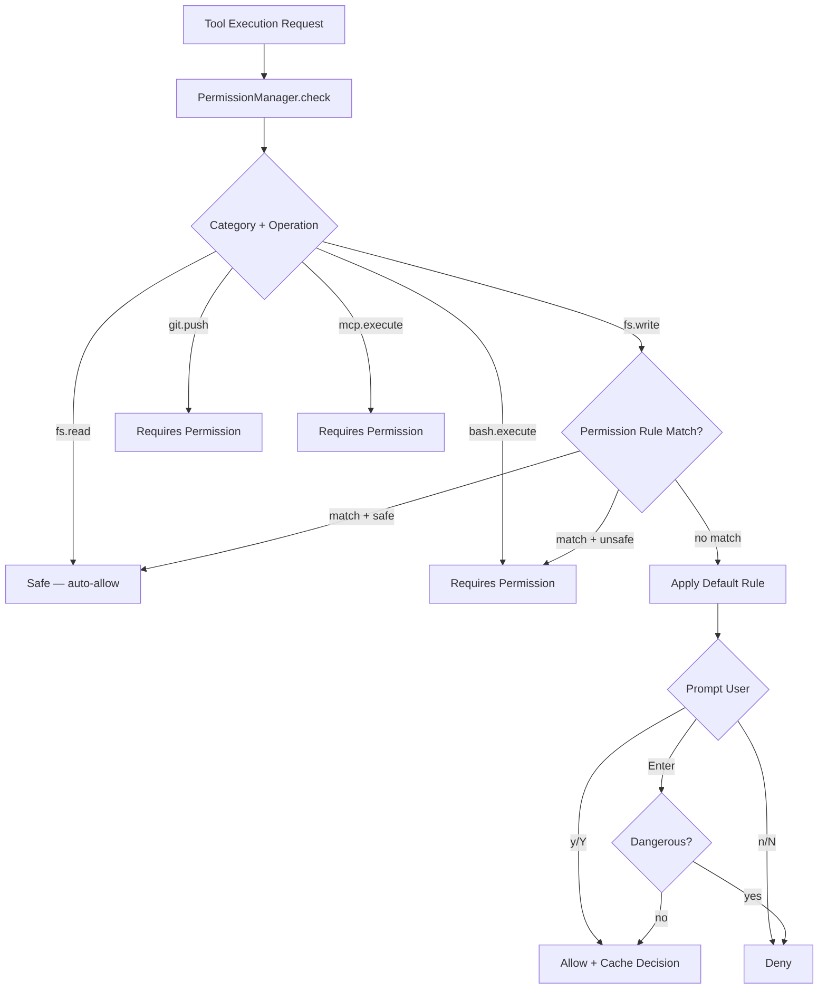
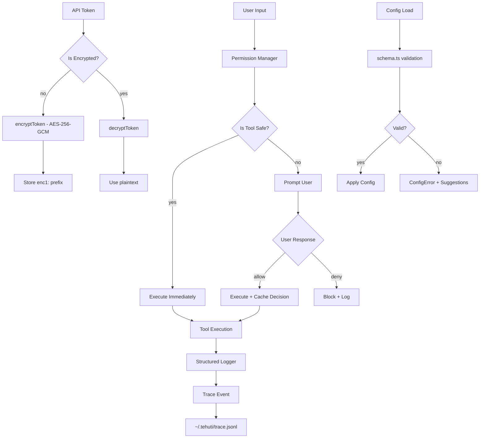

# Tehuti CLI — UI Architecture Guide

This document maps every visual component, hook, theme constant, and rendering
pipeline in the Tehuti TUI. It is the single reference for anyone modifying the
visual layer.

---

## Component Tree

The root is `chat.ts` (~5279 LOC), which exports `createProgram()`. The
interactive TUI is rendered via Ink's `render()` into a React tree:

```
chat.ts (Root — createProgram)
└── App                          # MouseProvider wrapper, manages mouseEnabled state
    └── ChatUI                   # Main TUI component (~4000 LOC, lines 905–4889)
        │
        ├── Header Bar (inline)  # " Tehuti • <model> • $<cost> … Ctrl+P • Ctrl+C"
        │
        ├── Config Warnings      # Inline yellow bordered boxes from configWarnings[]
        │
        ├── SwarmVisualizer      # Subagent observability dashboard (conditional: showDashboard)
        ├── MemoryIndicator      # Animated memory event toasts
        ├── TodoList             # Hierarchical task tree with status icons
        │
        ├── Message Area
        │   ├── (empty) ── Welcome Screen
        │   │   ├── Inline welcome box (version, model/provider, quick-start hints)
        │   │   └── TehutiHeader (compact=true, in scroll container)
        │   │
        │   └── (messages) ── Scroll Container
        │       ├── TehutiHeader (compact=true, first message when showWelcome)
        │       └── messageElements[] (useMemo)
        │           └── Per-message Box (key=m.id)
        │               ├── Role header (role-colored label + divider + timestamp)
        │               │   └── StatusBadge (compact, for assistant/system)
        │               ├── Text blocks → renderMarkdown() → Ink <Text> nodes
        │               ├── Reasoning blocks → renderReasoningBlock()
        │               └── Tool blocks → ExpandableToolOutput
        │
        ├── Error Overlay (inline, conditional: error)
        │
        ├── Thinking Overlay (conditional: showThinking)
        │   ├── HieroglyphSpinner (label="Reasoning…")
        │   └── thinking text
        │
        ├── Loading Overlay (conditional: loading)
        │   ├── ink-spinner Spinner (dots)
        │   ├── operationLabel text
        │   ├── streamingDisplayTokens / streamingDisplayElapsed
        │   └── ProgressBar
        │
        ├── StatusBar (inline, conditional: messages.length > 0)
        │   # git branch · context usage · active agents · duration · last error
        │
        ├── Prompt Area (paddingX=1, paddingTop=1)
        │   ├── PermissionPrompt   (conditional: pendingPermission, replaces input)
        │   ├── QuestionPrompt     (conditional: pendingQuestion, replaces input)
        │   └── Normal Input
        │       ├── CommandPalette (conditional: showCommandPalette)
        │       └── ChatBar        # always rendered when no overlay active
        │
        ├── ConfigEditor   (overlay, conditional: showConfigEditor)
        ├── SessionList    (overlay, conditional: showSessionList)
        ├── Profiler       (overlay, conditional: showProfiler)
        │
        └── Companion Mode Indicator (conditional: companionMode)
```

### Two-Column Mode

When the terminal is wide enough (`terminalWidth >= 140`), messages are split
into two balanced columns via `messageColumns`. User+assistant pairs are kept
together (never split across columns).

---

## System Overview

### Tool Inventory

The agent runtime exposes **86 native tools** across 17 categories, plus
dynamic MCP tools from connected servers:

| Category | Count | Tools |
|----------|-------|-------|
| Filesystem | 12 | `read`, `write`, `edit`, `create_dir`, `delete_file`, `delete_dir`, `copy`, `move`, `list_dir`, `file_info`, `read_image`, `read_pdf` |
| Search | 4 | `glob`, `grep`, `find_references`, `go_to_definition` |
| Bash | 1 | `bash` |
| Web | 3 | `web_fetch`, `web_search`, `code_search` |
| System | 6 | `todo_write`, `todo_complete`, `todo_delete`, `task`, `question`, `wait_for_event` |
| Git | 9 | `git_status`, `git_diff`, `git_log`, `git_add`, `git_commit`, `git_branch`, `git_remote`, `git_pull`, `git_push` |
| LSP | 4 | `lsp_find_references`, `lsp_go_to_definition`, `lsp_rename_symbol`, `lsp_hover` |
| Plan Mode | 4 | `write_plan`, `exit_plan_mode`, `list_plans`, `read_plan` |
| Memory | 2 | `store_insight`, `query_memory` |
| Background | 4 | `start_background`, `list_processes`, `read_output`, `kill_process` |
| Swarm | 6 | `delegate_task`, `check_subagent_status`, `await_subagents`, `list_subagents`, `abort_subagent`, `send_message_to_subagent` |
| Skills | 6 | `list_skills`, `activate_skill`, `deactivate_skill`, `find_skills`, `get_skill`, `create_reusable_skill` |
| Semantic | 4 | `semantic`, `semantic_init`, `semantic_status`, `semantic_trace` |
| Custom Provider | 4 | `configure_custom_provider`, `set_custom_header`, `remove_custom_header`, `get_custom_provider_info` |
| Kilocode | 5 | `review_code`, `summarize_context`, `configure_memory_bank`, `clear_memory`, `configure_streaming` |
| AST / Diff / DAP | 3 | `parse_ast`, `apply_diff`, `debug` |
| MCP Integration | 3 | `mcp_get_prompt`, `mcp_list_prompts`, `mcp_pipeline` |
| Utility | 3 | `env_inspect`, `network_check`, `service_status` |
| Collaboration | 1 | `collaboration` |
| Shadow Workspace | 1 | `test_speculatively` |
| Repo Map | 1 | `repo_map` |

MCP tools are discovered dynamically at runtime via `MCPClientManager`
(`src/mcp/client.ts`) and wrapped with the `mcp_<server>.<tool>` naming
convention. Tool count varies per session based on connected MCP servers.

### Test Coverage

| Category | Files | Description |
|----------|-------|-------------|
| Unit tests | **847** | `src/**/*.test.ts(x)` — tool logic, config, cache, hooks, rendering |
| E2E tests | **110** | `tests/e2e/` — baseline, tier1–4, sessions-ui, queue |


---

## Components

All components live in `src/cli/ui/components/`. The barrel export is
`index.ts`.

### ChatBar

**File:** `ChatBar.tsx`
**Role:** Input area — renders the text input line, cursor position, model/provider
badge, session cost, search bar, and completion hints.

| Prop | Type | Description |
|------|------|-------------|
| `input` | `string` | Current input text |
| `cursorPos` | `number` | Cursor offset in `input` |
| `selectionStart` / `selectionEnd` | `number \| null` | Active text selection range |
| `loading` | `boolean` | Disables input during generation |
| `historyIndex` / `historyLength` | `number` | History navigation state |
| `model` / `provider` | `string` | Displayed in badge |
| `companionMode` | `boolean` | Shows companion-mode indicator |
| `tokensUsed` / `sessionCost` | `number` | Cost display |
| `hideInput` | `boolean` | Hides the text input |
| `showSearch` | `boolean` | Switches to search-bar overlay (Ctrl+F) |
| `searchQuery` / `searchMatchCount` / `searchMatchIndex` | `number` | Search state |
| `sendError` | `string \| null` | Error message shown below input |
| `completionText` | `string` | Tab-completion ghost text |

**Sub-components rendered inline:**
- Search bar overlay (when `showSearch` is true)
- Line/column/selection status indicator
- Model/provider badge with color-coded border

---

### CommandPalette

**File:** `CommandPalette.tsx`
**Role:** Fuzzy command search (Ctrl+P). Lists slash commands, session actions,
model switching, and recent commands.

| Prop | Type | Description |
|------|------|-------------|
| `commands` | `CommandItem[]` | Available commands |
| `onSelect` | `(cmd: CommandItem) => void` | Fired on Enter or click |
| `onClose` | `() => void` | Escape handler |
| `visible` | `boolean` | Show/hide |
| `initialQuery` | `string` | Pre-filled search text |
| `onQueryChange` | `(q: string) => void` | Syncs input back to ChatBar |

**CommandItem interface:**
```typescript
interface CommandItem {
  id: string;
  label: string;
  description: string;
  usage?: string;
  shortcut?: string;
  aliases?: string[];
  category: "session" | "model" | "help" | "recent" | "submenu";
  action?: () => void | Promise<void>;
  submenu?: () => Promise<CommandItem[]> | CommandItem[];
}
```

**Features:** Fuzzy matching with scoring, category-sorted display, recent
commands persistence, mouse hover/click support via `@ink-tools/ink-mouse`,
virtual scrolling for large lists.

---

### ConfigEditor

**File:** `ConfigEditor.tsx`
**Role:** Tabbed configuration UI for API key, model, provider, base URL,
temperature, and max tokens.

| Prop | Type | Description |
|------|------|-------------|
| `config` | `{ apiKey?, model?, provider?, baseUrl?, temperature?, maxTokens? }` | Current values |
| `onSave` | `(updates: Partial<config>) => void` | Persist changes |
| `onCancel` | `() => void` | Close editor |
| `width` | `number` | Terminal width for layout |

**Sub-components (internal):**
- `ConfigTab` — clickable tab with gold/gray border
- `ConfigFieldRow` — editable field row with hover/focus states

**Features:** Tab navigation (API, Model, Advanced), inline editing, vim-style
navigation via `useVimInput`, virtual scrolling via `useVirtualScroll`, mouse
support.

---

### SessionList

**File:** `SessionList.tsx`
**Role:** Session management — lists saved sessions with metadata and
actions.

| Prop | Type | Description |
|------|------|-------------|
| `sessions` | `SessionMetadata[]` | All saved sessions |
| `onLoadSession` | `(id: string) => void` | Load selected session |
| `onClose` | `() => void` | Close list |

**Sub-component:** `SessionRow` — displays session ID, name, message count,
tokens, model, CWD, last message preview, and date. Supports mouse hover/click.

**Keyboard:** `useVimInput` for j/k/d/r bindings, `useVirtualScroll` for
pagination.

**Helpers:** `SessionsListHelpers.ts` — `formatDate()` (relative time) and
`colorizeModel()` (brand-colored model name).

---

### TehutiHeader

**File:** `TehutiHeader.tsx`
**Role:** Welcome screen and compact header — shows ASCII art, model/provider
badges, version, daemon status, skill count, context usage.

| Prop | Type | Description |
|------|------|-------------|
| `compact` | `boolean` | Compact mode (single line) |
| `model` / `provider` / `version` | `string` | Display info |
| `daemonStatus` | `"connected" \| "disconnected" \| "none"` | Daemon indicator |
| `companionMode` | `boolean` | Companion badge |
| `isStreaming` | `boolean` | Shows "Thinking…" |
| `hasUpdate` | `boolean` | Update available badge |
| `onModelClick` / `onConfigClick` / `onCommandClick` | `() => void` | Mouse callbacks |
| `activeSkills` | `number` | Skill count badge |
| `advisorEnabled` | `boolean` | Advisor indicator |
| `contextUsage` | `number` | Context percentage |

**Sub-component:** `ClickableBadge` — interactive badge with mouse hover state.

---

### ExpandableToolOutput

**File:** `ExpandableToolOutput.tsx`
**Role:** Collapsible tool result cards — shows tool name, status badge,
truncated preview, expandable full output with syntax highlighting.

| Prop | Type | Description |
|------|------|-------------|
| `toolName` | `string` | Display name (enhanced with icon) |
| `toolArgs` | `unknown` | Tool arguments (shown in expanded view) |
| `result` | `unknown` | Tool output (string, object, or structured result) |
| `maxWidth` | `number` | Max card width in columns |
| `status` | `"pending" \| "success" \| "error"` | Status badge |
| `isCached` | `boolean` | Shows cached indicator |
| `toolType` | `"readonly" \| "mutating"` | Tool category |
| `epistemicStatus` | `"verified" \| "speculative" \| "unverified"` | Confidence level |
| `defaultExpanded` | `boolean` | Initial expanded state |
| `isParallel` | `boolean` | Parallel execution indicator |

**Features:** Output summarization (`summarizeToolOutput()`), ANSI-safe slicing,
syntax highlighting via `highlightToAnsi`, virtual scrolling for large output,
mouse click/hover, keyboard expand/collapse. Max renderable output: 500,000 chars.

---

### MediaViewer

**File:** `MediaViewer.tsx`
**Role:** Terminal image rendering for local files.

| Prop | Type | Description |
|------|------|-------------|
| `src` | `string` | File path or `file://` URI |
| `alt` | `string` | Alt text |

Uses `renderMediaToTerminal()` from `utils/media.ts`. Handles resize events.
Shows loading spinner during async render.

---

### HieroglyphSpinner

**File:** `HieroglyphSpinner.tsx`
**Role:** Animated loading indicator cycling through Egyptian hieroglyphs (or
ASCII fallbacks).

| Prop | Type | Description |
|------|------|-------------|
| `glyphs` | `readonly string[]` | Glyph set (defaults to `HIEROGLYPHS.thinking`) |
| `label` | `string` | Text next to spinner |
| `color` | `string` | Text color |
| `speedMs` | `number` | Frame interval (default 150ms) |

Respects `TEHUTI_REDUCE_MOTION=1`.

---

### PermissionPrompt

**File:** `PermissionPrompt.tsx`
**Role:** Y/N permission dialog for tool execution.

| Prop | Type | Description |
|------|------|-------------|
| `request` | `PermissionRequest` | Tool name + args |
| `isDangerous` | `boolean` | Changes default to "no" |
| `onAnswer` | `(allowed: boolean) => void` | Response handler |

Dangerous prompts default to "no" on Enter; safe prompts default to "yes".

---

### QuestionPrompt

**File:** `QuestionPrompt.tsx`
**Role:** Multiple-choice or free-text question UI from the agent.

| Prop | Type | Description |
|------|------|-------------|
| `question` | `QuestionData` | Question with options |
| `onAnswer` | `(answer: string \| string[]) => void` | Selected answer |
| `onCancel` | `() => void` | Cancel handler |

**Features:** Keyboard navigation (j/k/arrows), multi-select (space toggle),
free-text input mode (Tab to switch), option filtering, mouse support.

---

### ProgressBar

**File:** `ProgressBar.tsx`
**Role:** Visual progress indicator with indeterminate mode.

| Prop | Type | Description |
|------|------|-------------|
| `value` | `number \| null \| undefined` | 0–100 or null for indeterminate |
| `label` | `string` | Header text |
| `width` | `number` | Bar width (default 40) |
| `showPercent` | `boolean` | Show percentage readout |
| `phase` | `"running" \| "success" \| "error" \| "warning"` | Color mode |
| `reduceMotion` | `boolean` | Disable animation |

Uses `█` (filled) and `░` (empty) characters for consistent alignment.

---

### StatusBadge

**File:** `StatusBadge.tsx`
**Role:** Semantic status icon and optional label.

| Prop | Type | Description |
|------|------|-------------|
| `kind` | `StatusKind` | Status type |
| `label` | `string` | Override label text |
| `compact` | `boolean` | Icon only (no label) |
| `emphasize` | `boolean` | Pill background |
| `reduceMotion` | `boolean` | Disable spin animation |

**StatusKind values:** `success`, `error`, `warning`, `info`, `pending`,
`running`, `idle`, `killed`, `cached`, `readonly`, `mutating`, `verified`,
`speculative`, `thinking`

---

### StatusIndicator

**File:** `StatusIndicator.tsx`
**Role:** `StatusBadge` + optional label in a horizontal layout with fade-in.

| Prop | Type | Description |
|------|------|-------------|
| `status` | `"success" \| "error" \| "loading"` | Badge kind |
| `label` | `string` | Text label |
| `animate` | `boolean` | Enable fade-in (default true) |

---

### TodoList

**File:** `TodoList.tsx`
**Role:** Hierarchical task list with status icons and priority colors.

Fetches todos from `getTodos()` (agent tools system). Renders as a tree with
indentation. Status icons: `☐` pending, `◐` in-progress, `✓` completed,
`✕` cancelled. Priority colors: high (red), medium (gold), low (green).

---

### SwarmVisualizer

**File:** `SwarmVisualizer.tsx`
**Role:** Real-time subagent observability dashboard.

Shows each subagent's ID, status, current task, tokens used, tool call count,
and elapsed time. Updates via `swarmManager` events at 150ms intervals.
Displays animated loading glyphs for active agents.

---

### Profiler

**File:** `Profiler.tsx`
**Role:** Trace event visualization for performance debugging.

Displays hierarchical trace events with actor, event name, duration bar,
and error indicators. Arrow keys to scroll through events, Escape/q to close.

---

### MemoryIndicator

**File:** `MemoryIndicator.tsx`
**Role:** Animated toast for memory bank events.

Listens to `agentEventBus` `memoryEvent` events. Shows purple (storing) or
green (success) indicators with auto-fade after 3 seconds.

---

## Hooks

All hooks live in `src/cli/ui/hooks/`.

### useChatState

**File:** `useChatState.ts`
**Purpose:** Central state manager — owns 30+ `useState` pairs for the entire
TUI. Every visual toggle, message, input state, and overlay flag lives here.

**State variables (33 total):**

| Variable | Type | Purpose |
|----------|------|---------|
| `messages` | `UiMessage[]` | Chat message history |
| `input` | `string` | Current input text |
| `cursorPos` | `number` | Cursor position in input |
| `selectionStart` / `selectionEnd` | `number \| null` | Text selection range |
| `loading` | `boolean` | Generation in progress |
| `error` | `string` | Current error message |
| `ctxModel` | `string` | Active model name |
| `runtimeProvider` | `string` | Active provider |
| `runtimeBaseUrl` | `string` | Provider base URL |
| `runtimeApiKey` | `string` | API key |
| `runtimeCustomProvider` | `RuntimeCustomProvider \| undefined` | Custom provider config |
| `scrollOffset` | `number` | Scroll position in lines |
| `history` / `historyIndex` | `string[]` / `number` | Input history navigation |
| `sessionId` | `string \| null` | Active session ID |
| `showWelcome` | `boolean` | Welcome screen visible |
| `sessionCost` | `number` | Running cost |
| `thinking` / `showThinking` | `string` / `boolean` | Extended thinking display |
| `showCommandPalette` | `boolean` | Command palette overlay |
| `showDashboard` | `boolean` | Swarm dashboard overlay |
| `showSessionList` | `boolean` | Session list overlay |
| `savedSessions` | `any[]` | Cached session list |
| `pendingQuestion` | `{ questions, resolve, reject } \| null` | Agent question |
| `progress` / `operationLabel` | `number` / `string` | Loading progress |
| `showConfigEditor` | `boolean` | Config editor overlay |
| `showProfiler` | `boolean` | Profiler overlay |
| `pendingPermission` | `{ request, isDangerous, resolve, reject } \| null` | Permission request |
| `queuedMessages` | `string[]` | Queued messages |
| `questionResolverRef` / `permissionResolverRef` | `MutableRefObject` | Resolver refs |

---

### useChatInput

**File:** `useChatInput.ts` (~1050 LOC)
**Purpose:** Keyboard handling, input history, command palette, search, scroll
navigation, and text editing.

**Props interface (`UseChatInputProps`):**

| Prop | Type | Description |
|------|------|-------------|
| `input` / `setInput` | `string` | Current input + setter |
| `cursorPos` / `setCursorPos` | `number` | Cursor position |
| `showCommandPalette` / `setShowCommandPalette` | `boolean` | Palette toggle |
| `history` / `setHistory` | `string[]` | Input history |
| `historyIndex` / `setHistoryIndex` | `number` | History navigation index |
| `inputBeforeHistoryRef` | `MutableRefObject<string>` | Pre-history input buffer |
| `commands` | `any[]` | Available commands |
| `sessionId` | `string \| null` | Session ID |
| `ctxRef` | `MutableRefObject<any>` | Agent context ref |
| `onExit` / `exit` | `() => void` | Exit handlers |
| `selectionStart` / `selectionEnd` | `number \| null` | Selection state |
| `loading` | `boolean` | Blocks input during generation |
| `scrollPageUp/PageDown/LineUp/LineDown/ToTop/ToBottom` | `() => void` | Scroll controls |
| `resetConversation` | `() => Promise<void>` | Reset handler |
| `send` | `(text: string) => Promise<void>` | Send handler |
| `saveHistory` | `(history: string[]) => Promise<void>` | History persistence |
| `showConfigEditor` / `showProfiler` | `boolean` | Overlay states |
| `pendingQuestion` | `any` | Question state |

**Features:**
- UTF-16 surrogate pair–safe cursor movement
- Mouse sequence buffering (50ms timeout for fragmented SGR sequences)
- Ctrl+C/Ctrl+D exit, Ctrl+P command palette, Ctrl+F search
- Ctrl+L clear, Ctrl+U line clear, Ctrl+W word delete
- Tab/Shift+Tab completion, Arrow up/down history, Enter send
- Page Up/Down scroll, Home/End navigation

---

### useChatViewport

**File:** `useChatViewport.ts` (~298 LOC)
**Purpose:** Scroll mechanics — tail following, line/page navigation, virtual
render window, message-arrival badge.

**Options (`UseChatViewportOptions`):**

| Option | Type | Description |
|--------|------|-------------|
| `messages` | `T[]` | All messages |
| `terminalHeight` / `terminalWidth` | `number` | Terminal dimensions |
| `headerHeight` | `number` | Height of fixed header |
| `promptOverlayHeight` | `number` | Height of input/prompt |
| `warningsHeight` | `number` | Height of warning banners |
| `paletteHeight` | `number` | Height of command palette |
| `loadingOverlayHeight` / `thinkingOverlayHeight` / `errorOverlayHeight` | `number` | Overlay heights |
| `dashboardOverlayHeight` | `number` | Dashboard height |
| `input` | `string` | Current input (for height calc) |
| `showWelcome` | `boolean` | Welcome screen active |
| `scrollOffset` / `setScrollOffset` | external state | Optional external scroll state |

**Return values (`UseChatViewportReturn`):**

| Value | Type | Description |
|-------|------|-------------|
| `visibleMessages` | `T[]` | Virtual slice for rendering |
| `scrollOffset` | `number` | Current offset (0 = bottom) |
| `totalMessageLines` | `number` | Estimated total height |
| `contentMaxWidth` | `number` | Available content width |
| `chatViewportHeight` | `number` | Viewport height |
| `isAtBottom` | `boolean` | At scroll bottom |
| `newMessageCount` | `number` | New messages while scrolled up |
| `scrollToBottom/Top` | `() => void` | Jump to edges |
| `scrollPageUp/Down` | `() => void` | Page navigation |
| `scrollLineUp/Down` | `() => void` | Line-by-line navigation |

**Status:** Fully implemented and tested but not yet imported into `chat.ts`
(the inline viewport logic in `ChatUI` predates this hook). Available for
future refactor.

---

### useVirtualScroll

**File:** `useVirtualScroll.ts` (~231 LOC)
**Purpose:** Generic virtual scrolling for lists (CommandPalette, SessionList,
ConfigEditor, ExpandableToolOutput).

**Options:**

| Option | Type | Default | Description |
|--------|------|---------|-------------|
| `totalItems` | `number` | — | Total list items |
| `maxVisibleWindow` | `number` | `15` | Visible rows |
| `initialSelectedIndex` | `number` | `0` | Starting selection |
| `mode` | `"cursor" \| "tailFollow"` | `"cursor"` | Behavior mode |

**Modes:**
- **cursor** — tracks a selected index, keeps it visible. For menus/palettes.
- **tailFollow** — auto-anchors to last N items. For log streams/chat tails.

**Return values:** `selectedIndex`, `windowStart`, `windowEnd`, `moveUp()`,
`moveDown()`, `scrollToIndex()`, `scrollToEnd()`, `visibleItems`, `tailFollowActive`,
`setTailFollowActive`.

---

### useVimInput

**File:** `useVimInput.ts` (~62 LOC)
**Purpose:** Vim-style keyboard bindings for list navigation.

**Props:**

| Prop | Type | Default | Description |
|------|------|---------|-------------|
| `isActive` | `boolean` | `true` | Enable/disable |
| `onUp` | `() => void` | — | `k` or Arrow Up |
| `onDown` | `() => void` | — | `j` or Arrow Down |
| `onSelect` | `() => void` | — | Enter |
| `onDelete` | `() => void` | — | `d` or Delete/Backspace |
| `onRename` | `() => void` | — | `r` |
| `onSearch` | `() => void` | — | `/` |

Used by: `SessionList`, `ConfigEditor`.

---

## Visual Theme

All colors are defined in `src/branding/index.ts` as `BRANDING.colors`.

### Core Palette

| Element | Name | Hex | WCAG Ratio vs #1A1A2E | Usage |
|---------|------|-----|------------------------|-------|
| Primary | Bright Gold | `#F5C518` | ≥7:1 (AAA) | Brand accent, borders, titles |
| Secondary | Classic Gold | `#D4AF37` | — | Subtle gold accents |
| Accent | Coral | `#FF6B35` | ≥4.5:1 (AA) | User messages, dangerous actions |
| Orange | Orange | `#E67D22` | — | Gradient stops |
| Nile | Blue | `#3B82F6` | 4.57:1 (AA) | Links, highlights, info |
| Sand | Sand | `#A08860` | 4.50:1 (AA) | Subtle text, descriptions |
| Green | Green | `#22C55E` | — | Success states |
| Red | Red | `#F05050` | 4.70:1 (AA) | Errors |
| Cyan | Cyan | `#06B6D4` | — | System messages, KaTeX |
| Purple | Purple | `#C084FC` | 5.65:1 (AA) | Reasoning/thinking |
| Gray | Gray | `#9CA3AF` | — | Dim text, inactive |
| Obsidian | Obsidian | `#1A1A2E` | — | Dark backgrounds |
| Papyrus | Papyrus | `#F5E6C8` | — | Light backgrounds |
| Code BG | Slate | `#1e293b` | — | Code block backgrounds |

### High Contrast Mode

Activated via `TEHUTI_HIGH_CONTRAST=1`. Uses brighter variants:

| Element | Hex | WCAG Level |
|---------|-----|------------|
| Primary | `#FFD700` | AAA |
| Secondary | `#FFA500` | High contrast |
| Accent | `#FF4500` | High contrast |
| Background | `#000000` | — |
| Foreground | `#FFFFFF` | — |

### Role Colors

Defined in `ROLE_COLORS` — maps message roles to brand colors:

| Role | Color | Hex |
|------|-------|-----|
| `user` | Coral | `#FF6B35` |
| `assistant` | Gold | `#F5C518` |
| `system` | Sand | `#A08860` |
| `error` | Red | `#F05050` |
| `success` | Green | `#22C55E` |
| `warning` | Gold | `#F5C518` |
| `info` | Cyan | `#06B6D4` |

### Gradient Stops

Used for `ink-gradient` in headers:

| Name | Stops | Usage |
|------|-------|-------|
| `tehu` | `#F5C518 → #FF6B35 → #D4AF37` | Title text |
| `splash` | `#F5C518 → #E67D22 → #A08860` | Splash screen |
| `header` | `#F5C518 → #D4AF37` | Compact header |
| `welcome` | `#D4AF37 → #FF6B35` | Welcome message |

### Hieroglyphs & Decorative Symbols

| Symbol | Unicode | ASCII Fallback | Usage |
|--------|---------|----------------|-------|
| Ibis | `𓆣` | `[T]` | Tehuti brand mark |
| Eye of Horus | `𓂀` | `[!]` | Error indicator |
| Ankh | `𓋹` | `[OK]` | Success indicator |
| Feather | `𓆄` | `~>` | User message prefix |
| Scroll | `𓏛` | `->` | System message prefix |
| Was scepter | `𓌀` | `[*]` | Authority marker |
| Thinking glyphs | `𓂝𓃀𓆣𓁹𓊖` | `....` | Loading animation |
| Loading glyphs | `𓆗𓆘𓆙𓆚𓆛` | `|/-\|` | Spinner animation |

**ASCII mode** activates via `TEHUTI_ASCII_MODE=1`, `NO_EMOJI=1`, or
`TERM=dumb`.

---

## Theme System

The theme system is centralized in `src/branding/index.ts` and supports
runtime configuration, high-contrast mode, and plugin-contributed themes.

### Architecture



### Color Resolution Pipeline

1. **Environment check**: `TEHUTI_HIGH_CONTRAST=1` → swap palette
2. **ASCII detection**: `TEHUTI_ASCII_MODE=1` / `NO_EMOJI=1` / `TERM=dumb`
3. **Component access**: `BRANDING.colors.primary` etc. — never hardcode hex
4. **Plugin overlay**: Plugin themes merged via `PluginRegistry` at activation

### Plugin Theme Interface

Plugins can contribute theme overrides via `PluginTheme`:

```typescript
interface PluginTheme {
  name: string;
  colors?: Partial<typeof BRANDING['colors']>;
  gradients?: Partial<typeof GRADIENT_STOPS>;
  hieroglyphs?: Partial<typeof HIEROGLYPHS>;
}
```

---


## Keyboard Shortcuts

### Global

| Shortcut | Action | Handler |
|----------|--------|---------|
| `Ctrl+C` | Cancel generation / exit | `useChatInput` |
| `Ctrl+D` | Exit (empty input) | `useChatInput` |
| `Ctrl+P` | Open command palette | `useChatInput` |
| `Ctrl+L` | Clear screen + history | `useChatInput` |
| `Ctrl+U` | Clear current line | `useChatInput` |
| `Ctrl+W` | Delete previous word | `useChatInput` |
| `Ctrl+A` | Move to line start | `useChatInput` |
| `Ctrl+E` | Move to line end | `useChatInput` |

### Input

| Shortcut | Action |
|----------|--------|
| `Enter` | Send message / confirm |
| `Tab` | Autocomplete / next suggestion |
| `Shift+Tab` | Previous suggestion |
| `Arrow Up` | Previous input in history |
| `Arrow Down` | Next input in history |
| `Arrow Left/Right` | Move cursor |
| `Home` / `Ctrl+A` | Cursor to start |
| `End` / `Ctrl+E` | Cursor to end |
| `Page Up` | Scroll up one page |
| `Page Down` | Scroll down one page |

### Search (Ctrl+F)

| Shortcut | Action |
|----------|--------|
| `Enter` | Find next match |
| `Shift+Enter` | Find previous match |
| `Escape` | Close search |

### List Navigation (SessionList, CommandPalette)

| Shortcut | Action |
|----------|--------|
| `j` / `Arrow Down` | Move down |
| `k` / `Arrow Up` | Move up |
| `Enter` | Select / open |
| `d` / `Delete` | Delete session (SessionList) |
| `r` | Rename session (SessionList) |
| `/` | Start search (SessionList) |
| `Escape` | Close |

### Overlays

| Shortcut | Action |
|----------|--------|
| `Escape` | Close any overlay |
| `q` | Close Profiler |
| `y` / `n` | Permission prompt (safe) |
| `Enter` | Permission prompt (safe = yes, dangerous = no) |

---

## Scroll Architecture

The TUI uses a **negative-margin scroll** approach:

1. **Negative Margin:** `marginBottom={-scrollOffset}` on the content container
   slides content upward. `scrollOffset=0` means "at bottom."

2. **Virtual Slice:** `visibleMessages` (computed in `useChatViewport`) limits
   the number of messages Ink actually renders, preventing performance
   degradation with large histories.

3. **Line Estimation:** `computeMessageLines()` in `output.ts` estimates the
   rendered height of each message without a full markdown parse, using
   character-width wrapping math. Results are cached in a WeakMap + LRU Map
   (max 500 entries).

### Why Not Array Slicing for Position

Do NOT slice `messages` to implement scroll — this breaks React's reconciliation
by changing array lengths and remounting components. The negative-margin + virtual
slice approach keeps the full array stable and only adjusts the CSS offset.

### Scroll State Flow

```
useChatState.scrollOffset     ← shared state
        ↓
useChatViewport               ← computes visibleMessages, totalMessageLines
        ↓
messageElements useMemo       ← renders visible slice
        ↓
<Box marginBottom={-scrollOffset}>  ← Ink negative margin slide
```

---

## Rendering Pipeline

### LLM Response → Screen

```
LLM Stream
  → processStreamChunk()          # Token accumulation, rate limiting
  → onToken callback              # Fires per token
  → StreamingOutputManager        # Buffered terminal writes (non-TUI mode)
  → message.content += token      # Appends to message state
  → renderMarkdown(content, width, key)  # markdown-mapper.tsx
  → renderInlineTokens() / renderToken()  # marked AST → ANSI strings
  → highlightToAnsi()             # Syntax highlighting for code blocks
  → Ink <Text> nodes              # React rendering
  → Terminal output               # Ink's reconciler
```

### Markdown Rendering

**File:** `src/cli/ui/markdown-mapper.tsx` (TUI mode)
**File:** `src/terminal/markdown.ts` (non-TUI / fallback mode)

Both use `marked` with `marked-katex-extension` for LaTeX support.

**Supported elements:**
- Headings (H1 gold+underline, H2 coral+underline, H3+ bold)
- Code blocks (syntax highlighted with line numbers)
- Inline code (cyan)
- Bold, italic, strikethrough
- Links (blue+underline)
- Lists (ordered/unordered with coral bullets)
- Blockquotes (dim pipe prefix)
- Tables (bordered grid)
- Images (placeholder text)
- KaTeX math (cyan)

### Tool Output Rendering

Tool results flow through `summarizeToolOutput()` → truncated preview →
`ExpandableToolOutput` → optional full expansion with virtual scrolling.
Syntax highlighting is applied via `highlightToAnsi()`.

### Height Estimation

`computeMessageLines()` in `output.ts` handles scroll height math:

1. Role header: 1 line
2. Text blocks: `computeMarkdownLines()` — splits by `\n`, estimates wrapping
3. Reasoning blocks: borders + wrapped content
4. Tool blocks: `computeToolHeight()` — border + header + preview/expanded lines
5. Margin: 1 line between messages

Results are cached with content-based keys for reuse across renders.

## Performance Optimizations

### Caching Layers

| Layer | Module | Strategy |
|-------|--------|----------|
| LRU Tool Cache | `src/agent/cache/lru-cache.ts` | Size-bounded, TTL-aware, file-mtime invalidation |
| Persistent Cache | `src/agent/cache/persistent-cache.ts` | Disk-backed across sessions |
| API Response Cache | `src/api/response-cache.ts` | SHA-256 key from messages + model, disk-backed |
| Height Cache | `src/cli/ui/terminal/output.ts` | WeakMap + LRU (500 entries), content-based keys |
| Encoding Cache | `src/agent/context-compressor.ts` | Token count memoization |

### Prefetching

`src/agent/prefetcher.ts` speculatively executes likely-next tools in the
background. Configurable via `performance.prefetchQueueSize` and
`performance.prefetchTimeoutMs`. Rules define tool→tool transition patterns
(e.g., `read` → `grep` on same file).

### Context Compression

`src/agent/context-compressor.ts` maintains a sliding window of active
messages. Older messages are summarized into a `CompactionDigest` with key
decisions, actions, and open threads — preserving context while reducing
token count. Uses `js-tiktoken` (cl100k_base) for accurate counting.

### Concurrency Control

`src/utils/concurrency.ts` provides bounded parallelism:
- `promiseAllWithConcurrency()` — pool-based parallel execution
- `promiseAllSettledWithConcurrency()` — fault-tolerant variant
- `mapWithConcurrency()` — parallel map with ordering preserved
- `TaskQueue` — persistent queue with retry and backpressure

### Streaming

`src/api/streaming.ts` uses chunked array concatenation for O(1) append
(avoids repeated string concatenation). Content and thinking streams are
maintained separately for reasoning models.

### Performance Flow



---

## Security Hardening

### Token Encryption

`src/config/token-encryption.ts` encrypts API tokens at rest using
AES-256-GCM:
- **Algorithm**: AES-256-GCM (128-bit IV + 128-bit auth tag)
- **Key derivation**: PBKDF2 (100,000 iterations) from machine identifiers
- **Format**: `enc1:<iv>:<authTag>:<ciphertext>` (hex-encoded)
- **Migration**: Transparent — plaintext tokens returned as-is, encrypted
  on next save via `encryptOAuthConfig()`

### Permission System

`src/permissions/rules.ts` enforces least-privilege tool execution:



### Security Features Summary

| Feature | Module | Description |
|---------|--------|-------------|
| Token encryption | `config/token-encryption.ts` | AES-256-GCM at rest |
| Permission rules | `permissions/rules.ts` | Category-based safe/unsafe classification |
| Permission prompts | `permissions/prompts.ts` | Context-aware prompt generation |
| Dangerous default | `PermissionPrompt.tsx` | Dangerous prompts default to "no" |
| Config validation | `config/schema.ts` | Schema-based input validation |
| Sandbox limits | `agent/tools/bash.ts` | Command allowlist/denylist |
| External FS guard | `agent/tools/fs.ts` | Read-external boundary enforcement |
| Structured logging | `utils/structured-logger.ts` | Audit trail for tool executions |
| Feature flags | `utils/feature-flags.ts` | Gradual rollout with A/B testing |

### Security Flow




---

## Accessibility

All accessibility utilities live in `src/cli/ui/accessibility.ts`.

### Reduced Motion

Controlled by `TEHUTI_REDUCE_MOTION=1` or `NO_ANIMATION=1`. Checked via
`respectReducedMotion()`. Components that animate:

| Component | Animation | Reduced Motion Behavior |
|-----------|-----------|------------------------|
| `HieroglyphSpinner` | Glyph cycling | Freezes on first glyph |
| `ProgressBar` | Indeterminate fill | Static bar, no pulse |
| `StatusBadge` | Spinning icon | Static icon |
| `MemoryIndicator` | Fade-in/toast | Single-frame appear/disappear |

### High Contrast Mode

Controlled by `TEHUTI_HIGH_CONTRAST=1`. Switches the entire color palette to
brighter variants with higher WCAG contrast ratios against `#1A1A2E`. See
the [Theme System](#theme-system) section for the full high-contrast palette.

### Color Detection

`shouldUseColors()` in `terminal/capabilities.ts` respects `NO_COLOR` env var.
`shouldUseHighContrast()` checks `TEHUTI_HIGH_CONTRAST`. All color functions
in `output.ts` and `markdown.ts` are no-ops when colors are disabled.

### Screen Reader Support

- `announceToScreenReader()` — emits attention signals for terminal screen
  readers via ANSI escape sequences
- All status changes emit semantic labels via `StatusBadge` kind values
- `ExpandableToolOutput` announces expand/collapse state changes

### Keyboard Navigation Hints

`KEYBOARD_HINTS` in `accessibility.ts` provides standardized hint strings
for TUI prompts. `keyboardHintLine()` joins hints with bullet separators:

| Key | Hint |
|-----|------|
| `↑↓` | Navigate |
| `Enter` | Select |
| `Esc` | Close |
| `Tab` | Switch mode |
| `?` | Help |

### Mouse Support

Mouse events via `@ink-tools/ink-mouse` (`MouseProvider`, `useOnClick`,
`useOnMouseEnter`, `useOnMouseLeave`). Disable via `TEHUTI_DISABLE_MOUSE=1`
or `NO_MOUSE=1`. Mouse sequences are buffered in `useChatInput` with a 50ms
timeout for fragmented SGR sequences.

### WCAG Compliance

The accessibility module provides `getContrastRatio(fg, bg)` and
`meetsContrastAA(fg, bg, threshold)` utilities for validating color
combinations against WCAG 2.1 AA (4.5:1) and AAA (7:1) thresholds.
All brand colors are pre-validated in the palette documentation.

---

## File Index

### Components (`src/cli/ui/components/`)

| File | Component | LOC |
|------|-----------|-----|
| `ChatBar.tsx` | `ChatBar` | 281 |
| `CommandPalette.tsx` | `CommandPalette`, `createCommands` | 950 |
| `ConfigEditor.tsx` | `ConfigEditor` | 482 |
| `SessionList.tsx` | `SessionList` | 296 |
| `TehutiHeader.tsx` | `TehutiHeader` | 239 |
| `ExpandableToolOutput.tsx` | `ExpandableToolOutput`, `summarizeToolOutput` | 544 |
| `MediaViewer.tsx` | `MediaViewer` | 98 |
| `HieroglyphSpinner.tsx` | `HieroglyphSpinner` | 44 |
| `PermissionPrompt.tsx` | `PermissionPrompt` | 107 |
| `QuestionPrompt.tsx` | `QuestionPrompt` | 320 |
| `ProgressBar.tsx` | `ProgressBar` | 158 |
| `StatusBadge.tsx` | `StatusBadge` | 164 |
| `StatusIndicator.tsx` | `StatusIndicator` | 52 |
| `TodoList.tsx` | `TodoList` | 198 |
| `SwarmVisualizer.tsx` | `SwarmVisualizer` | 224 |
| `Profiler.tsx` | `Profiler` | 128 |
| `MemoryIndicator.tsx` | `MemoryIndicator` | 91 |
| `SessionsListHelpers.ts` | `formatDate`, `colorizeModel` | 83 |

### Hooks (`src/cli/ui/hooks/`)

| File | Hook | LOC |
|------|------|-----|
| `useChatState.ts` | `useChatState` | 162 |
| `useChatInput.ts` | `useChatInput` | 1050 |
| `useChatViewport.ts` | `useChatViewport` | 298 |
| `useVirtualScroll.ts` | `useVirtualScroll` | 231 |
| `useVimInput.ts` | `useVimInput` | 62 |

### Terminal (`src/terminal/`)

| File | Exports | LOC |
|------|---------|-----|
| `output.ts` | `formatOutput`, `formatHeader`, `formatToolCall`, `formatCodeBlock`, `formatTable`, `formatProgress`, `truncate`, `computeMessageLines`, `wrap` | 621 |
| `markdown.ts` | `renderMarkdownToAnsi` | 453 |

### Branding (`src/branding/index.ts`)

| Export | Type | Description |
|--------|------|-------------|
| `BRANDING` | `const` | Name, version, colors, high-contrast palette |
| `ASCII_ART` | `const` | Full ASCII art logo |
| `GRADIENT_STOPS` | `const` | Gradient color arrays |
| `ROLE_COLORS` | `const` | Role → color mapping |
| `SPLASH_ASCII` | `const` | Splash screen art |
| `WELCOME_MESSAGE` | `const` | Welcome text |
| `FAREWELL_MESSAGE` | `const` | Exit text |
| `DECORATIVE` | `const` | Hieroglyphic decorative symbols |
| `HIEROGLYPHS` | `const` | Animated glyph sequences |
| `ASCII_DECORATIVE` | `const` | ASCII fallback symbols |
| `ASCII_HIEROGLYPHS` | `const` | ASCII fallback animations |
| `isAsciiMode` | `function` | Detect ASCII-only terminals |

### UI Utilities (`src/cli/ui/`)

| File | Purpose |
|------|---------|
| `chat-memory.ts` | `UiMessage`/`UiBlock` types, compaction formatting, truncation constants |
| `commandPaletteRecent.ts` | Recent command persistence |
| `input-state.ts` | `GlobalInputState` (hovered component count) |
| `accessibility.ts` | `respectReducedMotion()`, contrast ratio, screen reader, keyboard hints |
| `markdown-mapper.tsx` | `renderMarkdown()` — Ink-compatible markdown AST renderer |
| `utils/custom-provider.ts` | `normalizeCustomProvider()`, `RuntimeCustomProvider` type |

### Utilities (`src/utils/`)

| File | Purpose |
|------|---------|
| `metrics.ts` | OpenTelemetry-compatible metrics collector (counters, gauges, histograms) |
| `structured-logger.ts` | `StructuredLogger` — component-scoped log entries with ring buffer |
| `errors.ts` | `TehutiError` hierarchy: `ConfigError`, `APIError`, `PermissionError`, `ToolError` |
| `concurrency.ts` | `promiseAllWithConcurrency()`, `TaskQueue`, bounded parallelism primitives |
| `feature-flags.ts` | `FeatureFlagManager` — runtime flags, A/B testing, segment targeting |
| `trace.ts` | Per-second trace collector — ring buffer + JSONL persistence |
| `telemetry.ts` | Anonymous usage telemetry reporting |
| `media.ts` | `renderMediaToTerminal()` — image rendering for terminal display |
| `mouse.ts` | Mouse event parsing and SGR sequence buffering |
| `cli-output.ts` | Non-TUI formatted output helpers |
| `autocomplete.ts` | Tab-completion engine for commands and file paths |
| `verbose.ts` | Verbose/debug output gating |
| `dry-run.ts` | Dry-run mode — simulates mutations without executing |
| `debug.ts` | Debug logging with `TEHUTI_DEBUG` gate |

### Config (`src/config/`)

| File | Purpose |
|------|---------|
| `schema.ts` | Config schema definitions with validation |
| `loader.ts` | Config loading, merging, and file watching |
| `migration.ts` | Config version migration between schema versions |
| `wizard.ts` | Interactive config setup wizard |
| `device-providers.ts` | Device-specific provider configuration |
| `token-encryption.ts` | AES-256-GCM token encryption at rest |
| `providers.ts` | Provider definitions and registry |

### Session (`src/session/`)

| File | Purpose |
|------|---------|
| `manager.ts` | Session lifecycle — create, load, save, list, delete |
| `export.ts` | Session export to Markdown/JSON |
| `backup.ts` | Session backup and restore |
| `health.ts` | Session health monitoring and diagnostics |

### Permissions (`src/permissions/`)

| File | Purpose |
|------|---------|
| `rules.ts` | `PermissionManager`, category-based safe/unsafe classification |
| `prompts.ts` | Context-aware permission prompt generation |

### Plugins (`src/plugins/`)

| File | Purpose |
|------|---------|
| `registry.ts` | `PluginRegistry` — lifecycle, activation, contribution aggregation |
| `loader.ts` | Plugin discovery and dynamic import |
| `types.ts` | Plugin interface definitions (`PluginTool`, `PluginCommand`, `PluginTheme`) |

### SDK (`src/sdk/`)

| File | Purpose |
|------|---------|
| `plugin-api.ts` | `PluginContext` — safe API surface for plugin authors |
| `client.ts` | SDK client for external integrations |

### Messaging (`src/messaging/`)

| File | Purpose |
|------|---------|
| `connector-manager.ts` | Multi-channel message connector lifecycle |

### Hooks (`src/hooks/`)

| File | Purpose |
|------|---------|
| `executor.ts` | Pre/post-execution hook pipeline for tool calls |

### Provider Sources (`src/provider-sources/`)

| File | Purpose |
|------|---------|
| `codex-app-server.ts` | Codex app server provider discovery |
| `copilot-bridge.ts` | GitHub Copilot bridge provider |
| `local-probe.ts` | Local model server probing (Ollama, LM Studio) |

### Daemon (`src/daemon/`)

| File | Purpose |
|------|---------|
| `server.ts` | Background daemon HTTP server |
| `state-engine.ts` | Persistent state management for daemon |
| `client.ts` | Client library for daemon communication |

### Agent Core (`src/agent/`)

| File | Purpose |
|------|---------|
| `context-compressor.ts` | Context window compression via sliding-window summarization |
| `prefetcher.ts` | Speculative tool prefetching based on transition rules |
| `parallel-executor.ts` | Parallel tool execution with concurrency limits |
| `model-router.ts` | Model selection and routing logic |
| `events.ts` | Agent event bus for cross-component communication |
| `shadow-workspace.ts` | Speculative test execution in isolated workspace |


## Test Coverage Map

```mermaid
graph TD
    subgraph "Unit Tests (847 files)"
        A1[src/agent/tools/*.test.ts] -->|17 files| B1[Tool Logic]
        A2[src/agent/cache/*.test.ts] -->|3 files| B2[Caching]
        A3[src/agent/memory/*.test.ts] -->|3 files| B3[Memory / Graph]
        A4[src/agent/swarm/*.test.ts] -->|2 files| B4[Swarm Orchestration]
        A5[src/agent/loop/*.test.ts] -->|3 files| B5[Agent Loop]
        A6[src/agent/skills/*.test.ts] -->|2 files| B6[Skills]
        A7[src/config/*.test.ts] -->|4 files| B7[Config Schema & Migration]
        A8[src/cli/ui/**/*.test.ts] -->|12 files| B8[UI Components & Hooks]
        A9[src/utils/*.test.ts] -->|4 files| B9[Utilities]
        A10[src/api/*.test.ts] -->|1 file| B10[API Response Cache]
        A11[Other src tests] -->|39 files| B11[Agent, Session, Provider]
    end

    subgraph "E2E Tests (110 files)"
        C1[tests/e2e/baseline.test.ts] --> D1[Core Baseline]
        C2[tests/e2e/tier1.test.ts] --> D2[Tier 1 Features]
        C3[tests/e2e/tier2.test.ts] --> D3[Tier 2 Features]
        C4[tests/e2e/tiers3-4.test.ts] --> D4[Tier 3–4 Features]
        C5[tests/e2e/sessions-ui.test.ts] --> D5[Session Management]
        C6[tests/e2e/queue.test.ts] --> D6[Message Queue]
    end

    B1 --> E[Integration Boundary]
    B2 --> E
    B7 --> E
    B8 --> E
    D1 --> F[End-to-End Flow]
    D2 --> F
    D5 --> F
```



### Coverage by Subsystem

| Subsystem | Unit Files | E2E Files | Key Test Areas |
|-----------|-----------|-----------|----------------|
 | Agent Tools | 17 | — | fs, bash, git, web, search, AST, semantic, swarm |
| Caching | 3 | — | LRU eviction, TTL, persistence, tool cache |
| Config | 4 | — | Schema validation, migration, device providers |
| UI Components | 8 | 1 | ChatBar, CommandPalette, StatusBadge, sessions |
| UI Hooks | 4 | — | useChatInput, useChatViewport, useVirtualScroll |
| Memory | 3 | — | Vector store, graph, personality |
| Agent Loop | 3 | — | Retry, compression, tool processing |
| Session | 2 | 1 | Lifecycle, export, health |
| API | 1 | — | Response cache, streaming |
| Provider Sources | 3 | — | Codex, Copilot, local probe |
| Daemon | 1 | — | Server, state engine |
| E2E Integration | — | 6 | Baseline, tiers 1–4, sessions, queue |


---

## Adding New Components

1. Create the file in `src/cli/ui/components/` (PascalCase, `.tsx`)
2. Import and use existing hooks (`useChatState` for state, `useVirtualScroll`
   for lists, `useVimInput` for keyboard navigation)
3. Follow the role-color pattern: `BRANDING.colors` and `ROLE_COLORS` — never
   hardcode hex values
4. Add to the barrel export in `src/cli/ui/components/index.ts`
5. Mount in the `ChatUI` render tree in `chat.ts` (either inline in the main
   Box children or as a conditional overlay)
6. For overlays, add a `show*` boolean to `useChatState` and gate rendering
   in the render tree
7. For keyboard bindings, add handling to `useChatInput` or use `useInput` from
   Ink directly
8. Test with the Ink testing library (existing `*.test.ts(x)` files show patterns)

---

## Adding New Hooks

1. Create in `src/cli/ui/hooks/` (camelCase with `use` prefix, `.ts`)
2. Extract state logic from `chat.ts` into the new hook
3. Destructure the returned values in `ChatUI` alongside existing hooks
4. Keep the hook pure — no side effects except React state and refs

---

## Adding Slash Commands

1. Add the command definition to `createCommands()` in `CommandPalette.tsx`
2. Handle the command action in `handleCommandPaletteSelect()` in `chat.ts`
3. Add the slash variant (e.g., `/foo`) to the `slashCommands` array in
   `buildHelpText()` (chat.ts, ~line 342)
4. Set the `category` field for palette ordering
